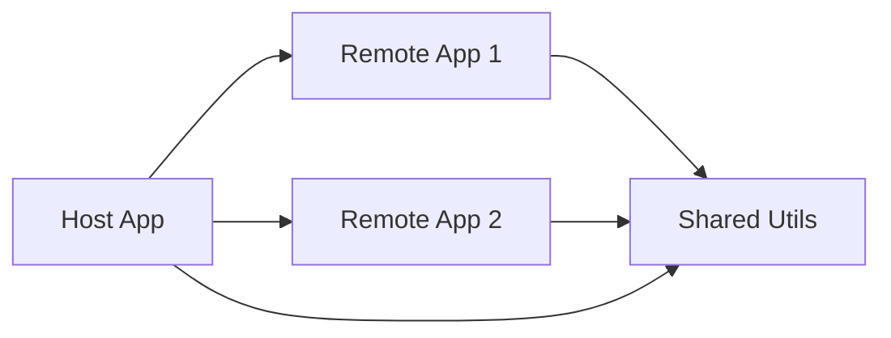

# Micro-Frontend Architecture

A modern, scalable micro-frontend application built with **Module Federation Enhanced**, **Rsbuild**, and **React 19**. This project demonstrates how to orchestrate multiple independent applications into a seamless user experience.

## 🚀 Quick Start

Get the entire system running in minutes.

```bash
# 1. Install dependencies for all apps
npm run install:all

# 2. Start the Host and all Remotes
npm run dev:all
```

For detailed setup instructions, including manual start and prerequisites, see **[Getting Started](./GETTING_STARTED.md)**.

## 📚 Documentation

We have comprehensive documentation to help you understand and modify this project:

| Document                                        | Description                                                        |
| ----------------------------------------------- | ------------------------------------------------------------------ |
| **[Getting Started](./GETTING_STARTED.md)**     | Installation, running the app, and dev scripts.                    |
| **[Project Structure](./PROJECT_STRUCTURE.md)** | Explanation of the monorepo layout and application roles.          |
| **[Architecture](./ARCHITECTURE.md)**           | High-level system design, data flow, and Module Federation config. |
| **[Technologies](./TECHNOLOGIES.md)**           | Detailed breakdown of the tech stack (Rsbuild, React 19, Redux).   |
| **[Tutorial](./TUTORIAL.md)**                   | Step-by-step guide to adding a new shared component.               |
| **[Learning Goals](./LEARNING_GOALS.md)**       | Educational concepts covered in this project.                      |
| **[Troubleshooting](./TROUBLESHOOTING.md)**     | Common errors and how to fix them.                                 |

## 🏗️ Architecture Overview

The project consists of a **Host App** (Container) that consumes features from **Remote Apps** and utilizes shared logic from **Shared Utils**.



_See [ARCHITECTURE.md](./ARCHITECTURE.md) for the complete design._

## 🔑 Key Features

- **⚡ Blazing Fast Builds**: Powered by **Rsbuild** (Rspack).
- **🔄 Module Federation Enhanced**: Advanced runtime sharing and version management.<!-- - **🛡️ Type Federation**: Seamless TypeScript support across micro-frontend boundaries (`@mf-types`). -->
- **🧠 Shared State**: Redux Toolkit & Singleton pattern implementation.
- **📡 Event Bus**: Decoupled cross-app communication.
- **🧭 Routing**: Unified navigation with React Router v7.

## 🤝 Contributing

1. **Linting**: `npm run lint:all`
2. **Build**: `npm run build:all`

This project is private and intended for educational & demonstration purposes.
